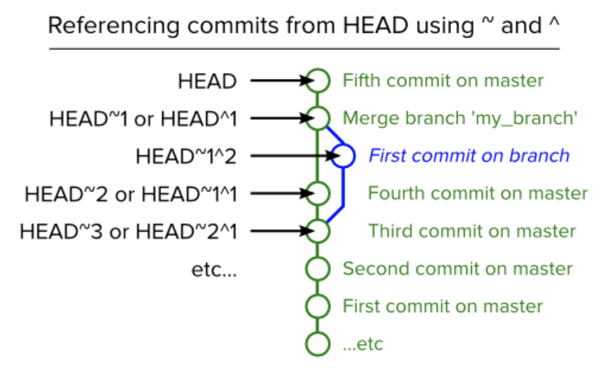

# Git sucks, this doesn't. Here's a guide to all github problems

##  CREATE GIT REPO FROM TERMINAL 

```
git init
git add *
git commit -m "initial commit"
git remote add origin "https://github.com/your_github_username/$repo_name.git"
git push -u origin master
```
*OR w/ SSH*

```
touch README.md
git init
git add README.md
git commit -m "first commit"
git remote add origin git@github.com:alexpchin/<reponame>.git
git push -u origin master
```

**Above still has problems**


## GIT RESET HARD/SOFT/MERGE 
[Complete Rundown](https://stackoverflow.com/questions/2530060/in-plain-english-what-does-git-reset-do)


Start:
```- A - B - C (HEAD, master)```

and you realize you want master to point to B, not C, you will use ```git reset B``` to move it there:
```- A - B (HEAD, master)      # - C is still here, but there's no branch pointing to it anymore```

Digression: This is different from a checkout. If you'd run git checkout B, you'd get this:
```- A - B (HEAD) - C (master)```

You've ended up in a detached HEAD state. HEAD, work tree, index all match B, but the master branch was left behind at C. If you make a new commit D at this point, you'll get this, which is probably not what you want:

```
- A - B - C (master)
       \
        D (HEAD)
```


### Git Reset Hard
```--hard``` makes everything match the commit you've reset to. This is the easiest to understand, probably. All of your local changes get clobbered. One primary use is blowing away your work but not switching commits: ```git reset --hard``` means git reset --hard HEAD, i.e. don't change the branch but get rid of all local changes. The other is simply moving a branch from one place to another, and keeping index/work tree in sync. This is the one that can really make you lose work, because it modifies your work tree. Be very very sure you want to throw away local work before you run any reset --hard.

### Git Reset Soft
--soft doesn't touch the index or work tree. All your files are intact as with --mixed, but all the changes show up as changes to be committed with git status (i.e. checked in in preparation for committing). Use this when you realize you've made some bad commits, but the work's all good - all you need to do is recommit it differently. The index is untouched, so you can commit immediately if you want - the resulting commit will have all the same content as where you were before you reset.

### Git Reset Mixed
--mixed is the default, i.e. git reset means git reset --mixed. It resets the index, but not the work tree. This means all your files are intact, but any differences between the original commit and the one you reset to will show up as local modifications (or untracked files) with git status. Use this when you realize you made some bad commits, but you want to keep all the work you've done so you can fix it up and recommit. In order to commit, you'll have to add files to the index again (git add ...).


The "strange notation" ```HEAD^ and HEAD~1``` you mention is simply a shorthand for specifying commits, without having to use a hash name like 3ebe3f6. It's fully documented in the "specifying revisions" section of the man page for git-rev-parse, with lots of examples and related syntax. The caret and the tilde actually mean different things:
```HEAD~``` is short for HEAD~1 and means the commit's first parent. ```HEAD~2``` means the commit's first parent's first parent. Think of ```HEAD~n``` as "n commits before HEAD" or "the nth generation ancestor of HEAD".
```HEAD^ (or HEAD^1)``` also means the commit's first parent. HEAD^2 means the commit's second parent. Remember, a normal merge commit has two parents - the first parent is the merged-into commit, and the second parent is the commit that was merged. In general, merges can actually have arbitrarily many parents (octopus merges). The `^` and `~` operators can be strung together, as in ```HEAD~3^2```, the second parent of the third-generation ancestor of HEAD,```HEAD^^2```, the second parent of the first parent of ```HEAD```, or even ```HEAD^^^```, which is equivalent to ```HEAD~3```.




